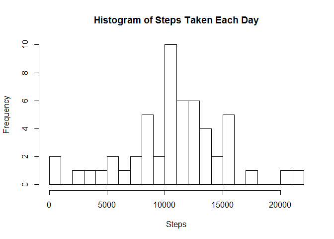
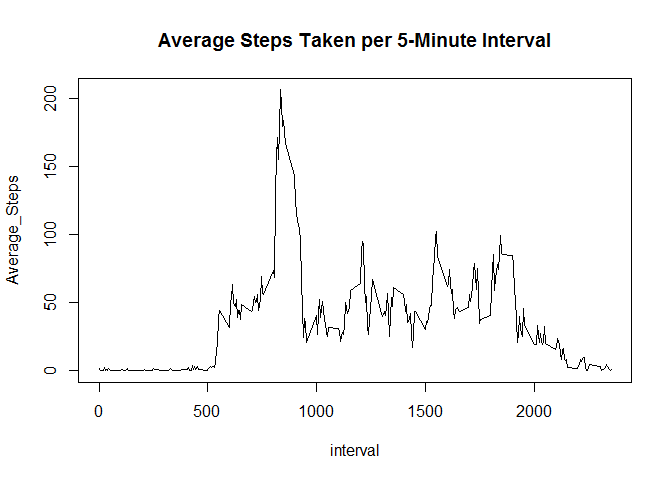
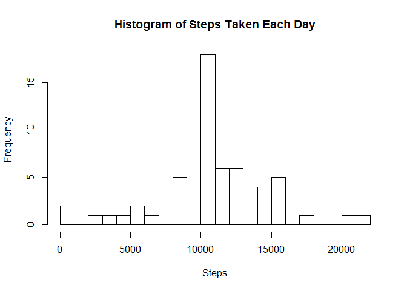
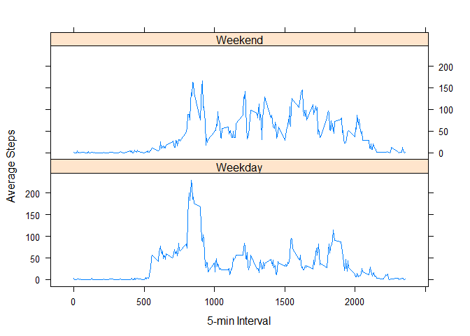

# Rep. Research WK1 Project
Thomas McMurtrie  
March 30, 2016  

First, point your working directory to the file where you have extracted the activity.csv file after downloading from either the
website or the forked github:  http://gitub.com/rdpeng/RepData_PeerAssessment1.  


```r
activity <- read.csv("activity.csv", header = TRUE)
```

---
What is the mean total number of steps taken per day?  

For this part of the assignment, you can ignore the missing values in the dataset.
1.  Calculate the total number of steps taken per day:

```r
steps_agg <- aggregate(steps ~ date, data = activity, sum)
head(steps_agg)
```

```
##         date steps
## 1 2012-10-02   126
## 2 2012-10-03 11352
## 3 2012-10-04 12116
## 4 2012-10-05 13294
## 5 2012-10-06 15420
## 6 2012-10-07 11015
```

2.  Make a histogram of the total number of steps taken each day.

```r
hist(steps_agg$steps, breaks = 20, main = "Histogram of Steps Taken Each Day", xlab = "Steps")
```

<!-- -->

3.  Calculate and report the mean and median of the total number of steps taken per day. 

```r
mean(steps_agg$steps, na.rm = TRUE)
```

```
## [1] 10766.19
```

```r
median(steps_agg$steps, na.rm = TRUE)
```

```
## [1] 10765
```
---

What is the average daily activity pattern?
1.  Make a time series plot (i.e., type = "l") of the 5-minute interval and the average number of steps taken, averaged across all days (y-axis).

```r
#  First, aggregate the data on the 5-minute intervals.  
interval_agg <- aggregate(steps ~ interval, data = activity, mean)
names(interval_agg)[2] <- "Average_Steps"
#  Then plot using the Base plot functionality.
with(interval_agg, plot(Average_Steps ~ interval, type = "l", main = "Average Steps Taken per 5-Minute Interval"))
```

<!-- -->

2.  Which 5-minute interval, on average across all the days in the dataset, contains the maximum number of steps?

```r
library(dplyr)
```

```
## Warning: package 'dplyr' was built under R version 3.2.3
```

```
## 
## Attaching package: 'dplyr'
```

```
## The following objects are masked from 'package:stats':
## 
##     filter, lag
```

```
## The following objects are masked from 'package:base':
## 
##     intersect, setdiff, setequal, union
```

```r
filter(interval_agg, Average_Steps==max(Average_Steps))
```

```
##   interval Average_Steps
## 1      835      206.1698
```
---

Imputing missing values

Note that there are a number of days/intervals where there are missing values (coded as NA).  The presence of missing days may introduce bias into some calculations or summaries of the data.  

1.  Calculate and report the total number of missing values in the dataset (i.e., the total number of rows with NAs).

```r
sum(is.na(activity$steps))
```

```
## [1] 2304
```

2.  Devise a strategy for filling in all of the missing values in the dataset.  The strategy does not need to be sophisticated.  For example, you could use the mean/median for that day, or the mean fo rthat 5-minute interval, etc.  

```r
#  I used the 5-minute interval means to impute the NA data.  
activity_new <- left_join(activity, interval_agg, by = "interval")
```

3.  Create a new dataset that is equal to the original dataset but with the missing data filled in.

```r
#  First, join the interval aggregate means to the original activity table.
activity_new$steps_fin <- ifelse(is.na(activity_new$steps), activity_new$steps_fin <- activity_new$Average_Steps, activity_new$steps_fin                             <- activity_new$steps)
activity_new <- select(activity_new, one_of(c("steps_fin", "date", "interval")))
names(activity_new)[1] <- "steps"
head(activity_new)
```

```
##       steps       date interval
## 1 1.7169811 2012-10-01        0
## 2 0.3396226 2012-10-01        5
## 3 0.1320755 2012-10-01       10
## 4 0.1509434 2012-10-01       15
## 5 0.0754717 2012-10-01       20
## 6 2.0943396 2012-10-01       25
```

4.  Make a histogram of the total number of steps taken each day and calculate and report the mean and median total number of steps taken per day.  Do these values differ from the estimates from the first part of the assignment?  What is the impact of imputing missing data on the estimates of the total daily number of steps?

```r
steps_agg_new <- aggregate(steps ~ date, data = activity_new, sum)
hist(steps_agg_new$steps, breaks = 20, main = "Histogram of Steps Taken Each Day", xlab = "Steps")
```

<!-- -->

The mean total number of steps taken per day is:

```r
mean(steps_agg_new$steps, na.rm = TRUE)
```

```
## [1] 10766.19
```

The median total number of steps taken per day is:

```r
median(steps_agg_new$steps, na.rm = TRUE)
```

```
## [1] 10766.19
```

As you can see, the mean value did not change because the imputed values were the mean of the 5-minute time intervals.  The median value increased slightly when calculated using the imputed values.  

Are there differences in activity patterns between weekday and weekends?

For this part, the weekdays() function may be of some help here.  Use the dataset with the filled-in missing values for this part.  

1.  Create a new factor variable in the dataset with two levels - "weekday" and "weekend," indicating whether a given date is a weekday or weekend day.  

```r
#  I add a date2 field by converting date from a factor variable to a date variable using the lubridate package. 
library(lubridate)
```

```
## Warning: package 'lubridate' was built under R version 3.2.3
```

```r
activity_new$date2 <- ymd(as.character(activity_new$date), tz = "UTC")
activity_new$day <- weekdays(activity_new$date2)
activity_new$weekday <- ifelse(activity_new$day %in% c("Saturday", "Sunday"), "Weekend", "Weekday")
interval_agg_new <- aggregate(steps ~ interval * weekday, data = activity_new, mean)
```


2.  Make a panel plot containing a time series plot (i.e., type = "l") o fthe 5-minute interval (x-axis) and the average number of steps taken, averaged across all weekday days or weekend days (y-axis).  See the README file in the GITHub repository to see an example of what this plot should look like using simulated data.

```r
library(lattice)
```

```
## Warning: package 'lattice' was built under R version 3.2.3
```

```r
xyplot(steps ~ interval | weekday, data = interval_agg_new, type = "l", layout = c(1,2), xlab = "5-min Interval", ylab = "Average Steps")
```

<!-- -->

